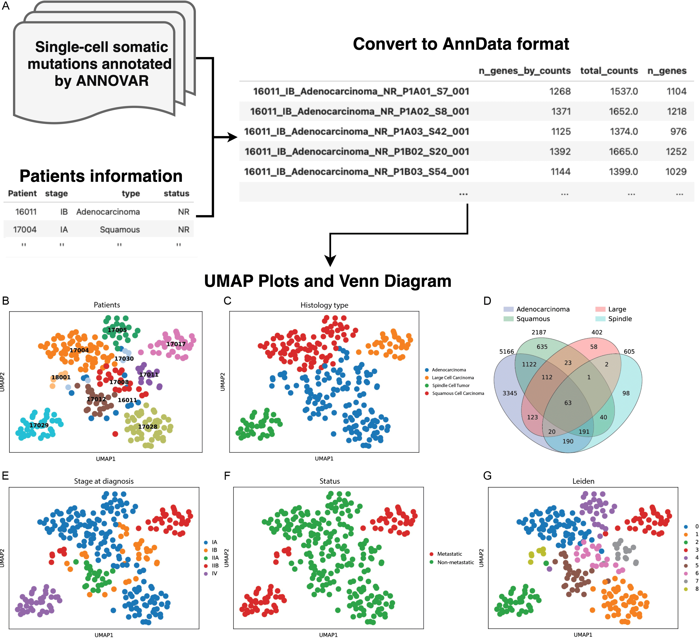

# Mugen-UMAP: UMAP visualization and clustering of mutated genes in single-cell DNA sequencing data.

This Python program provides a comprehensive pipeline for processing ANNOVAR files, converting them into AnnData format, and generating UMAP visualizations along with various summary reports based on single-cell DNA sequencing data.
&NewLine;



## Requirements
- Python3 (test on Python 3.10.5)
- scanpy
- numpy
- pandas
- venny4py
- matplotlib
- leidenalg

## Install
```
Clone the repository (git clone https://github.com/tengchn/Mugen-UMAP.git) directly to your local machine.
cd Mugen-UMAP
pip3 install numpy pandas scanpy venny4py leidenalg matplotlib
python3 src/Mugen-UMAP.py -h
```

## Usage
Mugen-UMAP offers three main features:

1. **Convert**
   - Convert ANNOVAR files and patient information metadata to UMAP input format (i.e., AnnData format).
```
python3 src/Mugen-UMAP.py convert [-h] [-i INPUT] [-p PATIENT] [-o OUTPUT]

options:
  -h, --help            show this help message and exit
  -i INPUT, --input INPUT
                        Input ANNOVAR zip file or ANNOVAR directory directly. [required]
  -p PATIENT, --patient PATIENT
                        Input patient information metadata file. If there is a patient ID column, it should be placed in the first column. [required]
  -o OUTPUT, --output OUTPUT
                        Output AnnData CSV format. [required]

  Example: python3 src/Mugen-UMAP.py convert -i Examples/SomSNVs_annovar.zip -p Examples/Patients_Stage.csv -o Examples/umap_format.csv
```
&NewLine;

2. **UMAP plot**
   - Plot UMAP figures from preprocessed data (i.e., AnnData format).
```
python3 src/Mugen-UMAP.py umap [-h] [-i INPUT_UMAP] [-c CATEGORY_INFO] [--min_cells MIN_CELLS] [--min_genes MIN_GENES] [--n_top_genes N_TOP_GENES]
                               [--n_neighbors N_NEIGHBORS] [--n_pcs N_PCS] [--leiden_resolution LEIDEN_RESOLUTION] [--plot_venn] [--venn VENN]

options:
  -h, --help            show this help message and exit
  -i INPUT_UMAP, --input_umap INPUT_UMAP
                        Path to UMAP input CSV file (i.e., AnnData format). [required]
  -c CATEGORY_INFO, --category_info CATEGORY_INFO
                        Input patient categorical information used in the sample name. For exmaple, the category_info for
                        '18001_IIB_Adenocarcinoma_Metastasis_p3D01_S76_001' should be 'Patient_stage_type_status'. [required]
  --min_cells MIN_CELLS
                        Minimum number of cells for filtering (default=3).
  --min_genes MIN_GENES
                        Minimum number of genes for filtering (default=30).
  --n_top_genes N_TOP_GENES
                        Number of top genes (default=3000).
  --n_neighbors N_NEIGHBORS
                        Number of neighbors for UMAP (default=60).
  --n_pcs N_PCS         Number of principal components (default=40).
  --leiden_resolution LEIDEN_RESOLUTION
                        Leiden algorithm resolution (default=1.5).
  --plot_venn           Whether to plot Venn diagram (default=True).
  --venn VENN           Which categorical information used to plot Venn diagram (default=type). NOTE: Cannot plot a Venn diagram for more than 4 groups.

  Example: python3 src/Mugen-UMAP.py umap -i Examples/umap_format.csv
```
&NewLine;

3. **All**
   - Execute full pipeline from ANNOVAR files to UMAP plotting.
```
python3 src/Mugen-UMAP.py all [-h] [-i INPUT] [-p PATIENT] [--min_cells MIN_CELLS] [--min_genes MIN_GENES] [--n_top_genes N_TOP_GENES]
                              [--n_neighbors N_NEIGHBORS] [--n_pcs N_PCS] [--leiden_resolution LEIDEN_RESOLUTION] [--plot_venn] [--venn VENN]

options:
  -h, --help            show this help message and exit
  -i INPUT, --input INPUT
                        Input ANNOVAR zip file or ANNOVAR directory directly. [required]
  -p PATIENT, --patient PATIENT
                        Input patient information metadata file. If there is a patient ID column, it should be placed in the first column. [required]
  --min_cells MIN_CELLS
                        Minimum number of cells for filtering (default=3).
  --min_genes MIN_GENES
                        Minimum number of genes for filtering (default=30).
  --n_top_genes N_TOP_GENES
                        Number of top genes (default=3000).
  --n_neighbors N_NEIGHBORS
                        Number of neighbors for UMAP (default=60).
  --n_pcs N_PCS         Number of principal components (default=40).
  --leiden_resolution LEIDEN_RESOLUTION
                        Leiden algorithm resolution (default=1.5).
  --plot_venn           Whether to plot Venn diagram (default=True).
  --venn VENN           Which categorical information used to plot Venn diagram (default=type). NOTE: Cannot plot a Venn diagram for more than 4 groups.

  Example: python3 src/Mugen-UMAP.py all -i Examples/SomSNVs_annovar.zip -p Examples/Patients_Stage.csv
```
